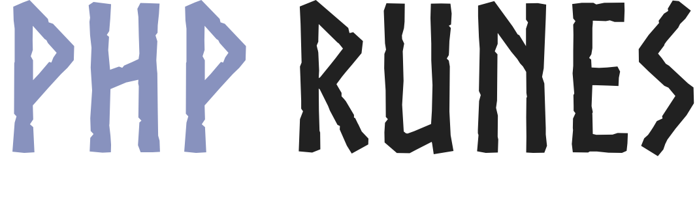

<p align="center">
    <br />
    
    <br />
</p>

[](https://packagist.org/packages/jordanbrauer/runes)
[](//packagist.org/packages/jordanbrauer/runes)
[](https://secure.php.net/releases/)
[](https://packagist.org/packages/jordanbrauer/runes)
[](https://github.com/jordanbrauer/runes/blob/master/LICENSE)

<!-- [](https://github.com/jordanbrauer/runes/actions?query=workflow%3ACI) -->
<!-- [](https://codeclimate.com/github/jordanbrauer/runes) -->
<!-- [](https://codeclimate.com/github/jordanbrauer/runes) -->
<!-- [](https://codeclimate.com/github/jordanbrauer/runes/issues) -->
[](https://github.com/jordanbrauer/runes)
[](https://packagist.org/packages/jordanbrauer/runes)

# Runes

A low-level string character analysis library for PHP.

See [compart unicode documentation](https://www.compart.com/en/unicode/) for useful information about unicode characters that PHP does not handle yet.

**Features:**

- Per-character (multi-byte aware) analysis;
- Script detection, differentiating look-a-like characters (see [IDN homograph attack](https://en.wikipedia.org/wiki/IDN_homograph_attack));
- Character encoding detection & conversion;
- Various serialization formats;

## Setup

Instructions on how to set this repository up for use in your own project, or as a develper contributing to this one.

### Requirements

There are not many requirements for this library. All of them are host machine related.

- PHP `>= 7.1`;
- PHP [Intl extension](https://www.php.net/manual/en/book.intl.php);
- [libicu](http://site.icu-project.org/);

### Installation

Use composer and your autoloader.

```bash
composer require jordanbrauer/runes
```

**For Contributors:**

Clone the repository and install the development tools to begin running tests for your features & bug fixes.

```bash
git clone https://github.com/jordanbrauer/runes.git \
  && cd ./runes \
  && composer install;
```

## Usage

Using the library is super simple. For a quick example, let's analyze the ancient, _yet [strangely familiar](https://en.wikipedia.org/wiki/Bluetooth#Logo)_, `ᛒ` from the [Elder Futhark](https://en.wikipedia.org/wiki/Elder_Futhark) writing system!

```php
use Rune\Rune;

$rune = new Rune('ᛒ');

dump($rune->toJson());
```

Would output the following data about the glyph.

```json
{
  "bidirectionalClass": "L",
  "binary": "111000011001101110010010",
  "blockCode": 35,
  "bytes": 1,
  "category": "Lo",
  "codepoint": "U+16D2",
  "combiningClass": 0,
  "decimal": 14785426,
  "encoding": "UTF-8",
  "glyph": "ᛒ",
  "hex": "e19b92",
  "isMirrored": false,
  "name": "RUNIC LETTER BERKANAN BEORC BJARKAN B",
  "script": "Runic",
  "utf16": "0x16D2",
  "utf32": "0x000016D2",
  "utf8": "0xE1 0x9B 0x92",
  "version": "3.0.0.0"
}
```

## Motivation

[Unicode is awesome](https://emojipedia.org/emoji-zwj-sequence/). However, it can be the source of much pain for programmers. This tool aims to help alleviate said pain by providing a low-level/generic API that allows you to focus on the problem without getting bogged down with UTF-8 and it's cousins.

### Project Name

Originally, the name of this project was UTFH8; a tongue-in-cheek word-play on the UTF-8 encoding algorithm and the (very strong) English word, _"hate"_, by using the number eight in place of the letters _"a-t-e"_, insinutating that at some point in every developer's career, they will say – _"I hate unicode"_.

Now, the project has been renamed to _Runes_, inspired by [Go's rune type](https://blog.golang.org/strings), and the Elder Futhark – something less harsh & sinister sounding.
